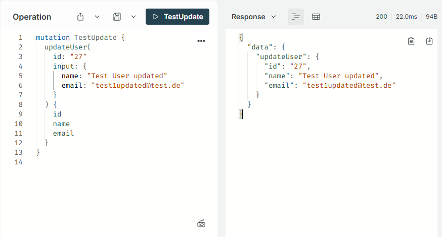

# Usermanagement
## Apollo - Prisma - Graphql

```bash
git clone https://github.com/bmehler/user-management-backend.git
user-management-backend
```
### Installing Node Modules
```bash
npm install
```
### Starting App
```bash
npm run start
```
### Open App
```bash
Server ready at http://localhost:4000/
```
### Apollo Graphql
